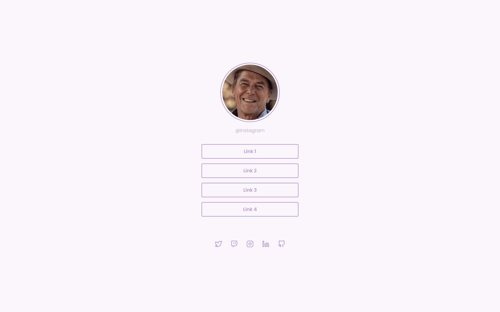

    

<h3 align="center">Social Links</h3>

  
  

## 🚀 Tecnologias

&nbsp;
&nbsp;

## 🔖 Layout

Layout do projeto: [aqui](hhttps://efficient-sloth-d85.notion.site/Desafio-Social-Tree-a4008e467a3248c4b05c97cf78aea44f#2e3cfaf746214ec6b3be28f470539cea).

